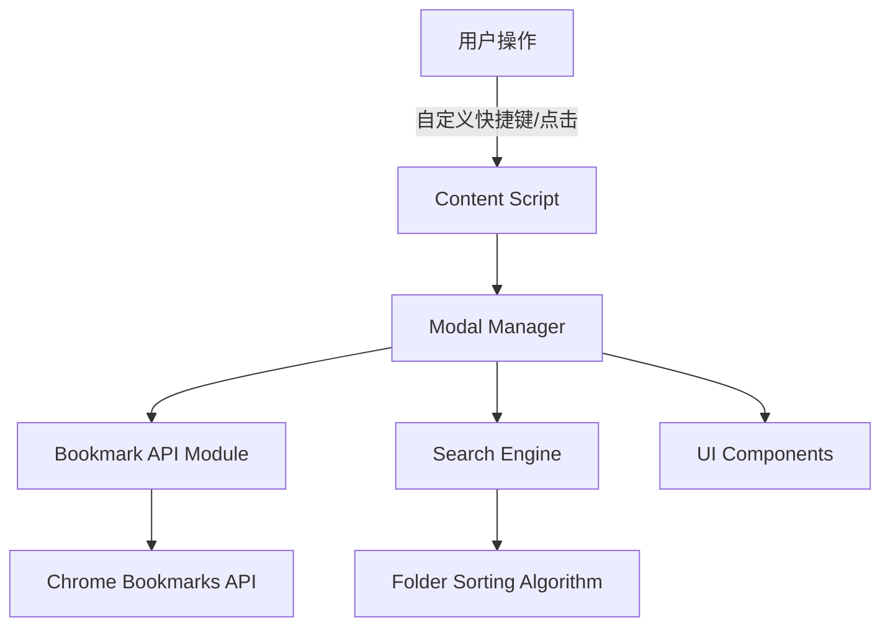

# 智能收藏夹扩展 - 开发者技术规范文档

## 1. 技术架构概览

### 1.1 系统架构图



### 1.2 技术栈说明

- **Runtime**: Chrome Extension Manifest V3
- **Language**: 原生 JavaScript (ES6+)
- **Styling**: 原生 CSS（包含响应式与主题样式）
- **API**: Chrome Bookmarks API
- **Storage**: chrome.storage.local（仅用于缓存与设置，不存用户内容）

## 2. 代码规范

### 2.1 文件命名规范

- 使用 kebab-case 命名法：如 `bookmark-modal.js`
- 组件文件以组件名命名：如 `search-bar.js`
- 工具函数文件以功能命名：如 `bookmark-api.js`

### 2.2 代码风格规范

```javascript
// 变量命名：camelCase
const bookmarkFolders = [];

// 函数命名：camelCase，动词开头
function getBookmarkFolders() {}

// 常量命名：UPPER_SNAKE_CASE
const MAX_RECENT_FOLDERS = 5;

// 注释规范：JSDoc格式
/**
 * 获取所有书签文件夹
 * @param {Array} bookmarkTree - 书签树结构
 * @returns {Array} 文件夹列表
 */
function extractFolders(bookmarkTree) {
  // 函数实现
}
```

### 2.3 错误处理规范

```javascript
// 使用try-catch包装异步操作
async function safeBookmarkOperation(operation) {
  try {
    return await operation();
  } catch (error) {
    console.error("[SmartBookmark]", error);
    // 用户友好的错误提示
    showToast("操作失败，请重试");
  }
}
```

## 3. 模块接口设计

### 3.1 Bookmark API 模块 (bookmark-api.js)

#### 接口定义

```javascript
/**
 * Bookmark API 封装模块
 * 提供与Chrome Bookmarks API的交互接口
 */
class BookmarkAPI {
  /**
   * 获取所有书签文件夹
   * @returns {Promise<Array<BookmarkFolder>>} 文件夹列表
   */
  async getAllFolders() {}

  /**
   * 创建书签
   * @param {string} folderId - 父文件夹ID
   * @param {string} title - 书签标题
   * @param {string} url - 书签URL
   * @returns {Promise<Bookmark>} 创建的书签对象
   */
  async createBookmark(folderId, title, url) {}

  /**
   * 搜索文件夹
   * @param {string} query - 搜索关键词
   * @returns {Promise<Array<BookmarkFolder>>} 匹配的文件夹
   */
  async searchFolders(query) {}

  /**
   * 计算文件夹活跃度
   * @param {string} folderId - 文件夹ID
   * @returns {Promise<number>} 活跃度分数
   */
  async calculateFolderActivity(folderId) {}
}
```

#### 数据结构

```javascript
/**
 * @typedef {Object} BookmarkFolder
 * @property {string} id - 文件夹唯一标识
 * @property {string} title - 文件夹名称
 * @property {Array} children - 子项目
 * @property {number} bookmarkCount - 书签数量
 */

/**
 * @typedef {Object} Bookmark
 * @property {string} id - 书签唯一标识
 * @property {string} title - 书签标题
 * @property {string} url - 书签URL
 * @property {string} parentId - 父文件夹ID
 */
```

### 3.2 Modal Manager 模块 (modal-manager.js)

#### 接口定义

```javascript
class ModalManager {
  /**
   * 显示收藏夹Modal
   * @param {Object} pageInfo - 当前页面信息 {title, url}
   */
  show(pageInfo) {}

  /**
   * 隐藏Modal
   */
  hide() {}

  /**
   * 更新Modal内容
   * @param {Array} folders - 文件夹列表
   */
  updateContent(folders) {}
}
```

### 3.3 Search Engine 模块 (search-engine.js)

#### 接口定义

```javascript
class SearchEngine {
  /**
   * 搜索文件夹
   * @param {string} query - 搜索关键词
   * @param {Array} folders - 待搜索文件夹列表
   * @returns {Array} 匹配的文件夹，按相关性排序
   */
  search(query, folders) {}

  /**
   * 计算匹配分数
   * @param {string} folderName - 文件夹名称
   * @param {string} query - 搜索关键词
   * @returns {number} 匹配分数 (0-1)
   */
  calculateScore(folderName, query) {}
}
```

### 3.4 Sorting Algorithm 模块 (sorting-algorithm.js)

#### 接口定义

```javascript
class SortingAlgorithm {
  /**
   * 按活跃度排序文件夹
   * @param {Array} folders - 文件夹列表
   * @returns {Promise<Array>} 排序后的文件夹列表
   */
  async sortByActivity(folders) {}

  /**
   * 获取最近使用的文件夹
   * @param {Array} folders - 所有文件夹
   * @param {number} limit - 返回数量限制
   * @returns {Promise<Array>} 最近使用的文件夹
   */
  async getRecentFolders(folders, limit = 5) {}
}
```

## 4. 项目结构详解

### 4.1 详细目录结构

```
smart-bookmark-extension/
├── manifest.json                 # 扩展配置
├── src/
│   ├── background.js             # 后台脚本
│   ├── content-script.js         # 内容脚本入口
│   ├── components/               # UI组件
│   │   ├── virtual-scroller.js   # 虚拟滚动组件
│   │   ├── ui-manager.js         # UI状态管理
│   │   ├── theme-manager.js      # 主题管理
│   │   ├── keyboard-manager.js   # 键盘导航
│   │   └── language-manager.js   # 多语言
│   ├── modal/                    # Modal控制器
│   │   └── modal-manager.js      # 主控制器
│   ├── utils/                    # 工具函数
│   │   ├── bookmark-api.js       # 书签API封装
│   │   ├── constants.js          # 常量定义
│   │   ├── helpers.js            # 辅助函数
│   │   ├── search-engine.js      # 搜索引擎
│   │   ├── sorting-algorithm.js  # 排序算法
│   │   ├── pin-manager.js        # 置顶管理
│   │   └── query-history.js      # 查询历史
│   └── styles/
│       └── modal.css             # 组件样式
├── icons/                       # 扩展图标
├── docs/                        # 文档
```

### 4.2 依赖管理

由于采用零依赖策略，所有代码均为原生实现：

- 使用原生 JavaScript API
- 使用原生 CSS
- 使用 Chrome 原生 API

## 5. 测试策略

### 5.1 手动验证（当前无自动化测试）

- 验证书签读取、搜索、创建流程
- 验证缓存与刷新机制
- 验证主题/语言切换与持久化

### 5.2 端到端验证

- 测试 Modal 与书签 API 的完整流程
- 测试搜索功能的准确性
- 测试扩展图标或自定义快捷键触发机制（默认未设置）
- 测试跨页面兼容性

### 5.3 性能测试

- Modal 加载时间 < 200ms
- 搜索响应时间 < 100ms
- 内存占用监控
- 大量文件夹性能测试

## 6. 部署和调试指南

### 6.1 开发环境设置

1. 克隆项目到本地
2. 打开 Chrome 扩展页面：`chrome://extensions/`
3. 启用"开发者模式"
4. 点击"加载已解压的扩展"
5. 选择项目根目录

### 6.2 调试工具

```javascript
// 启用调试模式
const DEBUG = true;

// 调试日志
function debugLog(...args) {
  if (DEBUG) {
    console.log("[SmartBookmark Debug]", ...args);
  }
}

// 性能监控
function measurePerformance(name, fn) {
  const start = performance.now();
  const result = fn();
  const end = performance.now();
  debugLog(`${name} took ${end - start}ms`);
  return result;
}
```

### 6.3 常见问题和解决方案

#### 问题 1：API 权限错误

```javascript
// 检查权限
if (!chrome.bookmarks) {
  console.error("Bookmarks API not available");
  // 提示用户检查权限
}
```

#### 问题 2：跨域问题

```javascript
// 确保在manifest.json中正确配置权限
{
    "permissions": ["bookmarks", "activeTab"],
    "host_permissions": ["<all_urls>"]
}
```

### 6.4 构建和发布

由于采用零构建策略，发布流程简化：

1. 确保所有文件在正确位置
2. 验证 manifest.json 配置
3. 测试所有功能
4. 打包为 zip 文件
5. 上传到 Chrome Web Store

## 7. 性能优化指南

### 7.1 内存管理

```javascript
// 及时清理事件监听器
class ModalManager {
  cleanup() {
    this.modal.removeEventListener("click", this.handleClick);
    this.searchInput.removeEventListener("input", this.handleSearch);
  }
}
```

### 7.2 缓存策略

```javascript
// 简单的内存缓存
const cache = {
    folders: null,
    lastFetch: 0,
    TTL: 5000 // 5秒缓存

    getCachedFolders() {
        if (Date.now() - this.lastFetch < this.TTL) {
            return this.folders;
        }
        return null;
    }
};
```

## 8. 版本控制和更新策略

### 8.1 版本管理

- 遵循语义化版本号：MAJOR.MINOR.PATCH
- 每次更新同步更新 manifest.json 中的版本号
- 保持向后兼容性

### 8.2 更新检查

```javascript
// 检查扩展更新
chrome.runtime.onUpdateAvailable.addListener((details) => {
  console.log("Extension update available:", details.version);
  // 提示用户更新
});
```

## 9. 安全考虑

### 9.1 输入验证

```javascript
function validateBookmarkData(title, url) {
  if (!title || title.length > 100) {
    throw new Error("Invalid title");
  }
  if (!url || !url.startsWith("http")) {
    throw new Error("Invalid URL");
  }
}
```

### 9.2 权限最小化

- 只请求必要的权限
- 避免访问敏感用户数据
- 所有操作都需要用户明确确认

## 10. 开发者工具

### 10.1 开发辅助脚本

```javascript
// 快速重置扩展状态
function resetExtension() {
  if (chrome.storage && chrome.storage.local) {
    chrome.storage.local.clear();
  }
  location.reload();
}

// 模拟书签数据（开发用）
function generateMockFolders(count = 20) {
  return Array.from({ length: count }, (_, i) => ({
    id: `folder${i}`,
    title: `开发文件夹 ${i}`,
    children: [],
  }));
}
```
